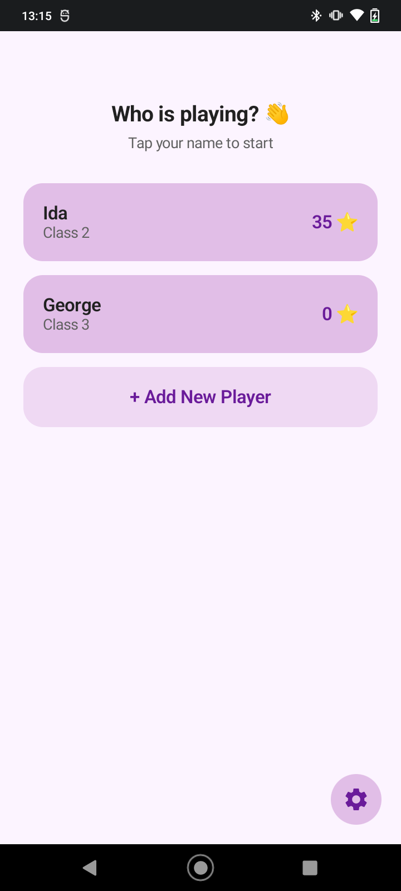
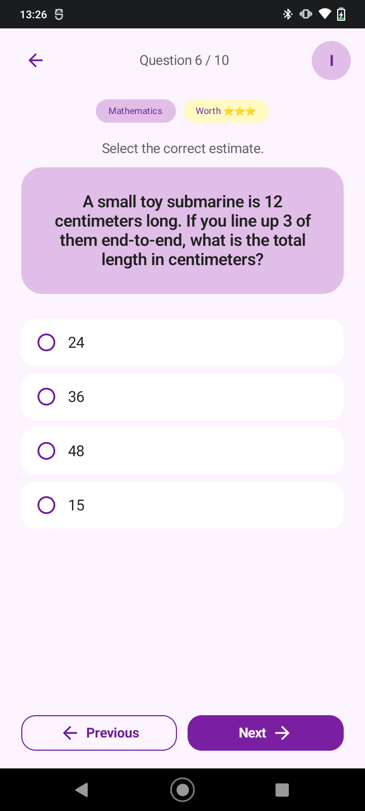
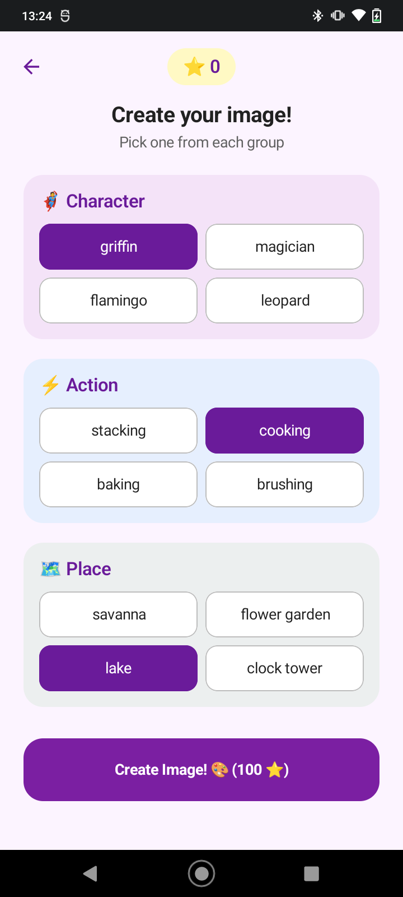
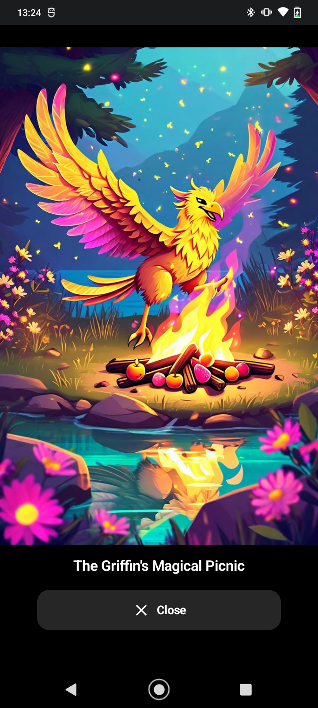
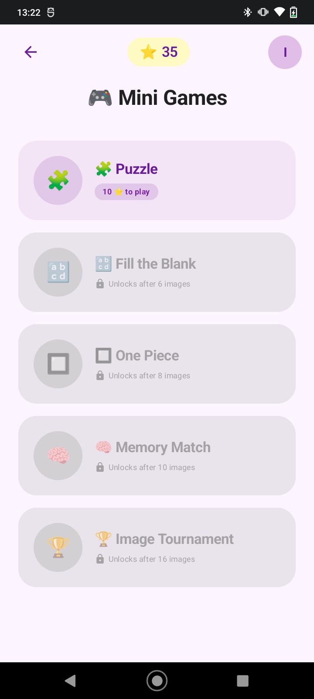
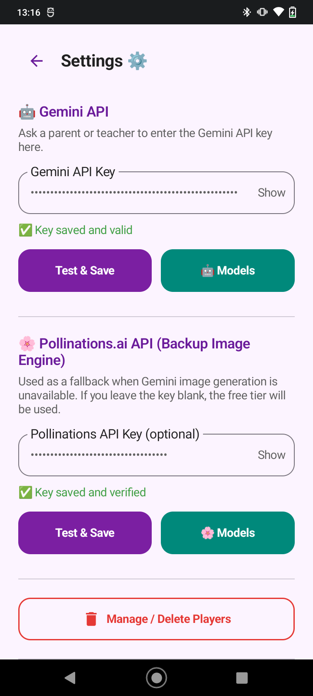
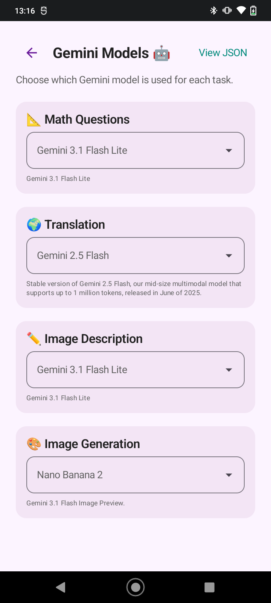
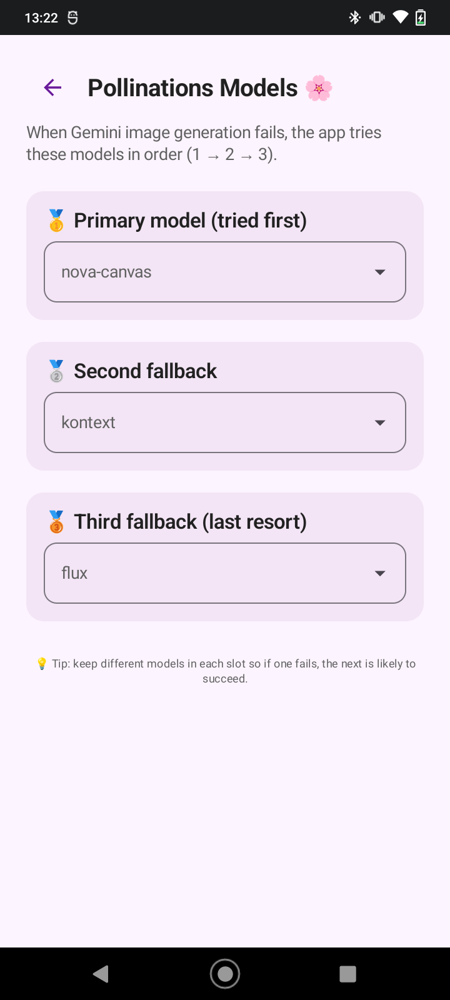

# GalleriaIDA

**GalleriaIDA** is an Android language-learning app for elementary school students. Players earn ⭐ stars by taking quizzes in their native language, then spend those stars to generate unique AI images that fill their personal gallery. Once they have a gallery, a suite of mini-games lets them revisit and play with their own images — turning the reward into a game.

---

## Table of Contents

1. [How it works](#how-it-works)
2. [Star economy](#star-economy)
3. [Mini-games](#mini-games)
4. [Setup for teachers & parents](#setup-for-teachers--parents)
5. [For developers](#for-developers)

---

## How it works

1. A teacher or parent sets up the app once — see [Setup for teachers & parents](#setup-for-teachers--parents).
2. Each student creates a **player profile** with their name, native language, school class, and where they are in the school year.
3. Players take **quizzes** — questions generated by AI in the player's own language, calibrated to their school year.

4. Correct answers earn **stars**. Accumulate 100 ⭐ to create an AI-generated image.
5. When creating an image the player picks one word from three vocabulary groups (character, action, place). The app turns those words into a unique image.

 

6. The image lands in the player's **Gallery**.
7. Once a player has enough gallery images, **Mini-Games** unlock one by one.

The entire player-facing UI is displayed in the player's chosen language automatically — no manual setup required.

---

## Star economy

| Action | Stars |
|---|---|
| Correct quiz answer | +3 ⭐ |
| All questions correct (perfect score bonus) | +10 ⭐ |
| One question wrong (near-perfect bonus) | +3 ⭐ |
| Create an image | −100 ⭐ |
| Play Puzzle | −10 ⭐ |
| Play Fill the Blank | −10 ⭐ |
| Play Memory Match | −10 ⭐ |
| Play One Piece | −5 ⭐ |
| Image Tournament | Free |

Stars are deducted the moment a paid mini-game starts and are **not refunded** if the player exits early.

---

## Mini-games

All mini-games are reached from the **Mini Games** hub. Each game unlocks automatically once the player's gallery is large enough.

| Game | Unlocks after | Cost |
|---|---|---|
| Puzzle | 1 image | 10 ⭐ |
| Fill the Blank | 6 images | 10 ⭐ |
| One Piece | 8 images | 5 ⭐ |
| Memory Match | 10 images | 10 ⭐ |
| Image Tournament | 16 images | Free |

### 🧩 Puzzle

A gallery image is sliced into a grid of tiles and shuffled. The player drags and swaps tiles to restore the original picture.

- **Easy** — 4 × 4 (16 tiles)
- **Medium** — 4 × 5 (20 tiles)
- **Hard** — 4 × 8 (32 tiles)

### 🔡 Fill the Blank

A gallery image is shown **blurred**. The title has some letters missing — shown as blank slots. The player taps letter tiles from a tray below to fill in the blanks and reveal the sharp image.

- **Easy** — 30% of letters missing
- **Medium** — 50% of letters missing
- **Hard** — 70% of letters missing
- Multi-round format; each round uses a different gallery image

### 🔲 One Piece

A tiny, randomly cropped fragment of a gallery image is shown. The player picks which full image it came from out of multiple-choice options.

- **Easy** — 1/49 of the image (7×7 grid), displayed large
- **Medium** — 1/64 of the image (8×8 grid), displayed medium
- **Hard** — 1/100 of the image (10×10 grid), displayed small
- Costs only 5 ⭐

### 🧠 Memory Match

Classic pairs/concentration game using the player's own gallery images. Each image appears twice face-down. Players flip two cards at a time — matching pairs stay face-up.

- **Easy** — 3 × 4 grid (6 pairs)
- **Medium** — 4 × 4 grid (8 pairs)
- **Hard** — 4 × 5 grid (10 pairs)
- Move counter and timer track performance

### 🏆 Image Tournament

A single-elimination bracket tournament where the player votes for their favourite image in head-to-head matchups.

- Requires 16 gallery images
- Bracket stages: R16 → QF → SF → Final
- Free to play

---

## Setup for teachers & parents

### What you need

- An Android device running Android 9 or higher
- A Gemini API key (free) — [How to get a Gemini API key](docs/gemini-api-key.md)
- A Pollinations API key (optional, free) — [How to get a Pollinations API key](docs/pollinations-api-key.md)

### First-time setup

1. Open the app and tap the **⚙️** icon in the bottom-right corner of the screen.
2. Enter your **Gemini API key** and tap **Test & Save**.

  

3. The app will load the available AI models. Assign one to each slot:
   - **Questions** — generates quiz questions (e.g. `gemini-2.0-flash`)
   - **Translation** — translates the app UI into the player's language
   - **Image Prompt** — builds the image description from the player's word choices
   - **Image Generation** — creates the actual image (e.g. `imagen-3.0-generate-002`)
4. Optionally enter a **Pollinations API key**.
5. Tap the back arrow to return to the player selection screen.

> ⚠️ Gemini currently does not offer an image generation model (such as Imagen) in their free tier. If you are using the free Gemini API key, the Image Generation slot will not work. This is why the app includes Pollinations as a fallback — Pollinations generates images for free and requires no API key. Make sure to configure at least one Pollinations model in Settings so image creation works out of the box.

### Adding players

Tap **+ Add New Player** and fill in:

- **Name** — the student's display name
- **Language** — their native language (the app UI and quizzes will use this)
- **School class** — 1 to 6 (elementary school grade)
- **School-year position** — Beginning, Middle, or End (adjusts quiz difficulty)

---

## For developers

See the [Developer Guide](docs/DEVELOPER.md) for architecture notes, build instructions, and contribution guidelines.
