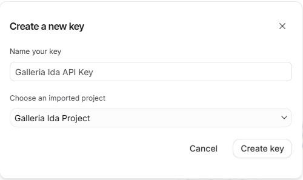
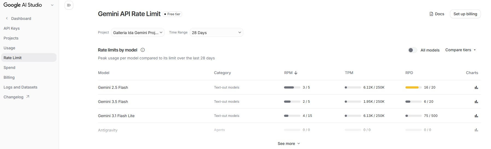

# How to get a Gemini API key

GalleriaIDA uses Google's Gemini AI to generate quiz questions, translate the app interface, and create images. You need a free API key from Google AI Studio to use these features.

---

## Step-by-step

### 1. Go to Google AI Studio

Open your browser and go to **[aistudio.google.com](https://aistudio.google.com)**.

You will need a Google account (Gmail). If you don't have one, create it for free at [accounts.google.com](https://accounts.google.com).

---

### 2. Sign in

Click **Sign in** and log in with your Google account.

---

### 3. Create an API key

1. In the left sidebar, click **Dashboard**   
3. In the top right of the Dashboard page click **Create API key**
4. Write a Name for your key (eg. Galleria Ida API Key)
5. Choose **+ Create Project** (recommended) or select an existing project if you have one



4. Your API key will be displayed — it looks like this:
   ```
   AIzaSyXXXXXXXXXXXXXXXXXXXXXXXXXXXXXXXX
   ```
5. Click the **copy** icon to copy it

> ⚠️ **Keep your API key private.** Do not share it or post it publicly. Anyone with your key can use your quota.

---

### 4. Enter the key in GalleriaIDA

1. Open GalleriaIDA and tap the **⚙️** icon (bottom-right on most screens)
2. Paste your key in the **Gemini API Key** field
3. Tap **Test & Save**
4. If the key is valid, the model selectors will populate automatically

---

## Free tier limits

- The free tier of Gemini is sufficient for normal use.
- Limits can be seen in Google AI Studio **Rate Limit** section.



- If the app shows a "server is busy" message, you have hit the per-minute limit — wait a moment and try again.
- For higher limits, Google offers paid plans via [Google Cloud](https://cloud.google.com/vertex-ai).
 
> ⚠️ Gemini currently **does not** offer an image generation model (such as Imagen) in their free tier. If you are using the free Gemini API key, the Image Generation slot will not work. This is why the app includes Pollinations as a fallback — Pollinations generates images for free. Make sure to configure at least one Pollinations model in Settings so image creation works out of the box.

---

## Troubleshooting

**"API key not valid"** — make sure you copied the full key with no extra spaces.

**"The server is busy"** — you have hit the free-tier rate limit. Wait 60 seconds and try again.

**Models not loading** — check your internet connection, then tap Test & Save again.
