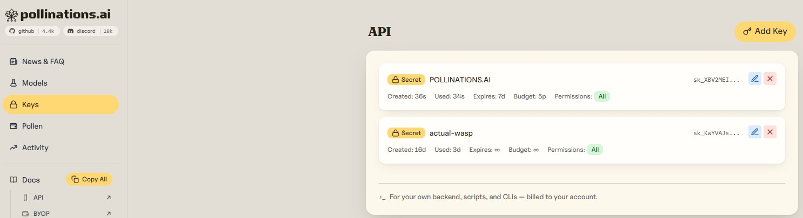
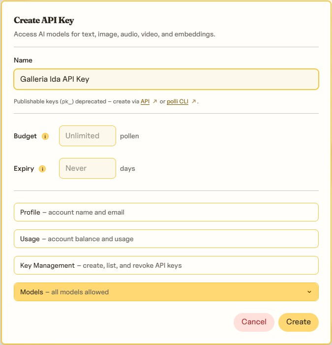

# How to get a Pollinations API key

GalleriaIDA uses [Pollinations](https://pollinations.ai) as a fallback image generation service.

---

## Getting an API key

### 1. Go to Pollinations

As of 2025, Pollinations API access is granted on request rather than via instant self-serve signup.
https://enter.pollinations.ai/sign-in
1. Go to **[pollinations.ai/sign-in](https://enter.pollinations.ai/sign-in)** or look for the **"For developers"** / **"API access"** link on the homepage
2. Opt to **Sign in with GitHub** when creating your Pollinations account. If you don't have a GitHub account, go to [github.com](https://github.com) and create one using **Sign up with Google** — that way you don't need to create separate accounts and everything stays linked to your Google account.
4. Go to **[enter.pollinations.ai/#keys](https://enter.pollinations.ai/#keys)**

5. Click **Add Key**
6. Fill-out the **Name** but leave the **Budget** and **Expiry** empty

The limits per model can be found [here](https://enter.pollinations.ai/#models).

---

### 3. Enter the key in GalleriaIDA

1. Open GalleriaIDA and tap the **⚙️** icon (bottom-right on most screens)
2. Paste your key in the **Pollinations API Key** field
3. Tap **Test & Save**

> ⚠️ Depending on server load, image creation may take **up to 4 minutes**. Please be patient and keep the app open until the image appears.

---

## Troubleshooting

**Images fail to generate** — if both Gemini and all Pollinations fallback models fail, check your internet connection. The app will display which model it is currently trying.

**Key not accepted** — make sure there are no extra spaces when pasting the key into Settings.
